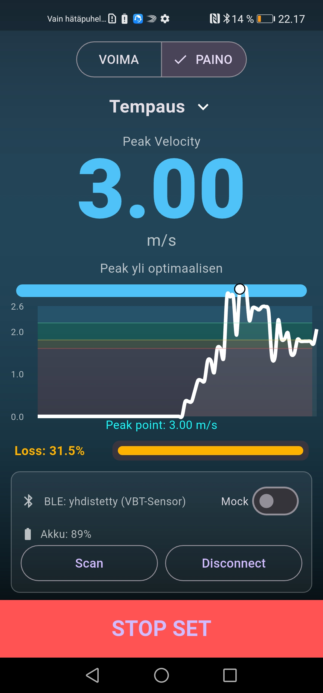

# Velocity-Based Training (VBT) - Device

Tämä projekti on osa Oulun ammattikorkeakoulun tieto- ja viestintätekniikan toisen vuoden kevään sovellusprojekti-kurssia (2026). Projektin kesto on 7 viikkoa.

## Sisällysluettelo
* [Yleiskuvaus](#yleiskuvaus)
* [Laitteisto ja komponentit](#laitteisto-ja-komponentit)
* [Ohjelmisto ja teknologiat](#ohjelmisto-ja-teknologiat)
* [Toiminnallisuus](#toiminnallisuus)
* [Projektin hallinta](#projektin-hallinta)
* [Kuvat](#kuvat)

---

## Yleiskuvaus
Projektin tavoitteena on suunnitella ja toteuttaa Velocity-Based Training (VBT) -laite. Laite on tarkoitettu painonnostoon, jossa se mittaa levytangon liikettä ja antaa nostajalle reaaliaikaista palautetta noston nopeudesta ja räjähtävyydestä. 

Laite kiinnitetään tankoon, ja se lähettää kiihtyvyysdataa langattomasti Android-puhelimeen, joka visualisoi tiedon käyttäjälle graafisessa muodossa.

## Laitteisto ja komponentit
Piirilevy (PCB) on suunniteltu **KiCadilla** noudattaen **Aislerin** suunnittelusääntöjä: [aisler-support](https://github.com/AislerHQ/aisler-support). Laitteen sydämenä toimii ESP32-mikrokontrolleri.

### Komponenttilista:
* **Mikrokontrolleri:** ESP32 C3 Supermini
* **Anturi:** BMI270 (Kiihtyvyysanturi, I2C-väylä)
* **Virranhallinta:** * TP4056 (Latauspiiri)
    * MCP1700 (Regulaattori)

    * Vastukset: R1, R4 (4,7kΩ), R2, R3 (100kΩ), R5 (2,4kΩ), R6, R7 (10kΩ)
    * Kondensaattorit: C1, C2 (1µF), C3, C4 (100nF), C5, C6 (10µF)
* **Akku:** 3,7V litiumpolymeeriakku (Li-Po)
* **Älypuhelin** Huawei Honor View 20 (testikäyttöpuhelin)

## Ohjelmisto ja teknologiat
Projektissa on käytetty nykyaikaisia kehitystyökaluja ja kieliä:

* **Firmware:** ESP32 on ohjelmoitu C++-kielellä käyttäen **VS Codea**.
* **Mobiilisovellus:** Käyttöliittymä on toteutettu **Flutterilla** (Dart).
* **Viestintä:** Laitteen ja puhelimen välinen tiedonsiirto tapahtuu **Bluetooth Low Energy (BLE)** -yhteydellä.
* **Väylät:** ESP32 ja BMI270 kommunikoivat keskenään **I2C**-väylän kautta.

Puhelimeen asennettiin ohjelmisto yhdistämällä puhelin tietokoneeseen USB-kaapelilla ja ajamalla flutterohjelma suoraan puhelimeen. Käyttöjärjestelmän päivitykset ajetaan demovaiheessa suoraan testipuhelimeen.

Laitteen ohjelmistoon on koodattu virrankulutuksen optimointi.

## Toiminnallisuus
1. **Mittaus:** BMI270-anturi lukee tangon kiihtyvyyttä.
2. **Analyysi:** Data lähetetään BLE-yhteyden yli mobiilisovellukseen.
3. **Visualisointi:** Sovellus piirtää kiihtyvyydestä graafia ja laskee noston räjähtävyyden.
4. **Virransäästö:** Akunkestoa optimoidaan ohjelmallisesti asettamalla ESP32 lepotilaan (Deep Sleep), kun laitetta ei käytetä.
5. **Akun seuranta:** Käyttöliittymästä voi seurata reaaliajassa laitteen akun varaustilaa.

## Projektin hallinta
Projekti toteutettiin ketterillä menetelmillä ja se sisälsi seuraavat vaiheet:
* Vaatimusmäärittely ja projektisuunnitelman laatiminen.
* Sulautetun laitteen elektroniikan ja layout-suunnittelun.
* Ohjelmiston toteutuksen (Firmware & Mobile).
* Prototyypin testauksen ja käyttöönoton.

---

## Kuvat

### Piirilevyn valmistus

Kuvassa piirilevy on upotettu pahvimuottiin, jonka päälle stensiili saadaan asetettua tiiviisti piirilevyä vasten pastan levitystä varten.

Komponentit aseteltiin piirilevylle käsin.

BMI270 komponentti on pieni ja sen padit ovat osan pohjassa, joten sen kanssa piti olla erityisen tarkka asetellessa sitä piirilevylle.

Valmis ja uunitettu piirilevy sekä akku.

Kuva käyttöliittymästä.
### Järjestelmäkaavio
**

## Tulevaisuus
Tulevaisuudessa ohjelmistoa on tarkoitus kehittää niin, että eri nostoliikkeistä (takakyykky, maastaveto, penkkipunnerrus, tempaus, rinnalleveto ja rinnalleveto + työntö) on olemassa valmiit datasetit joiden perusteella ohjelma pystyy antamaan selkeän palautteen onko suoritus onnistunut ja mikä on nostajan kehityskaari. Tässä vaiheessa pääpaino on siinä, että laite toimii luotettavasti ja tehokkaasti, pystyy siirtämään ja näyttämään dataa reaaliaikaisesti, sekä seuraamaan akun varausta.