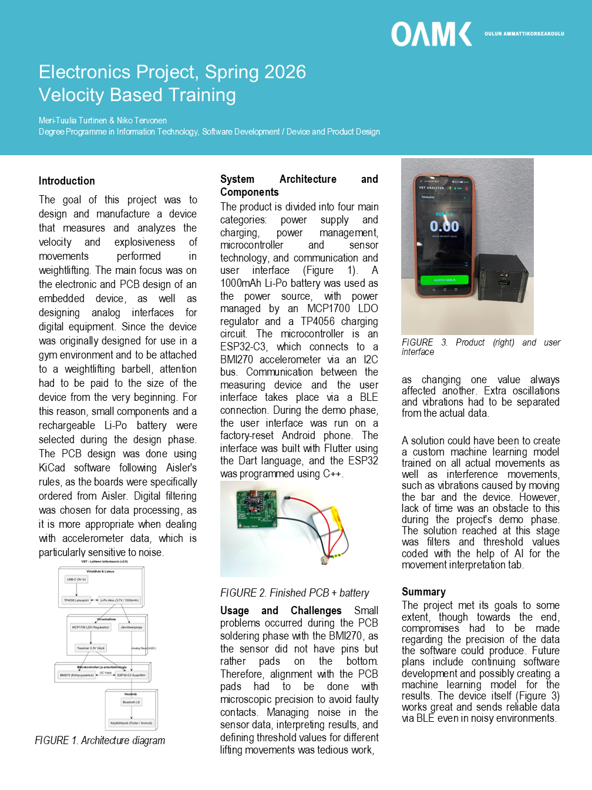
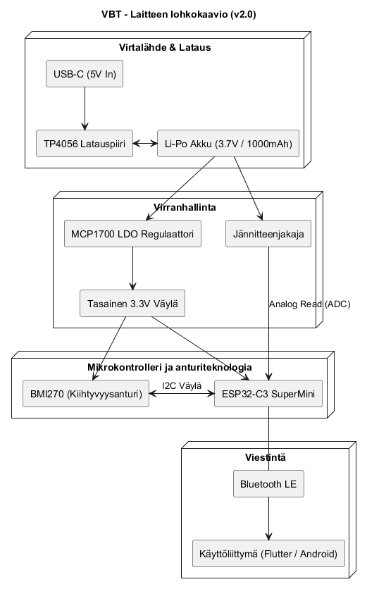

# Velocity-Based Training (VBT) - Device

[Suomeksi](README.md) | [In English](README_eng.md)

---

This project is part of the electronics application project course (Spring 2026) in the second year of Information and Communication Technology at Oulu University of Applied Sciences. The duration of the project is 7 weeks.

## Table of Contents
* [Overview](#overview)
* [Hardware and Components](#hardware-and-components)
* [Software and Technologies](#software-and-technologies)
* [Functionality](#functionality)
* [Project Management](#project-management)
* [Images](#images)

---

## Overview
The goal of the project is to design and implement a Velocity-Based Training (VBT) device. The device is intended for weightlifting, where it measures the movement of the barbell and provides the lifter with real-time feedback on the velocity and explosiveness of the lift.

The device is attached to the bar and sends acceleration data wirelessly to an Android phone, which visualizes the data for the user in a graphical format.

## Poster
The poster provides a condensed overview of the project's goals, methods, and key results.

## Hardware and Components
The Printed Circuit Board (PCB) was designed using **KiCad** following **Aisler's** design rules: [aisler-support](https://github.com/AislerHQ/aisler-support). An ESP32 microcontroller serves as the heart of the device.

### Component List:
* **Microcontroller:** ESP32 C3 Supermini
* **Sensor:** BMI270 (Accelerometer, I2C bus)
* **Power Management:**
    * TP4056 (Charging circuit)
    * MCP1700 (Regulator)
    * Resistors: R1, R4 (4.7kΩ), R2, R3 (100kΩ), R5 (2.4kΩ), R6, R7 (10kΩ)
    * Capacitors: C1, C2 (1µF), C3, C4 (100nF), C5, C6 (10µF)
* **Battery:** 3.7V Lithium Polymer (Li-Po) battery
* **Smartphone:** Huawei Honor View 20 (Testing device)

## Software and Technologies
Modern development tools and languages were used in the project:

* **Firmware:** The ESP32 is programmed in C++ using **VS Code**.
* **Mobile Application:** The user interface is implemented with **Flutter** (Dart).
* **Communication:** Data transfer between the device and the phone occurs via **Bluetooth Low Energy (BLE)**.
* **Buses:** The ESP32 and BMI270 communicate with each other via the **I2C** bus.

The software was installed on the phone by connecting it to a computer via USB and running the Flutter program directly on the device. During the demo phase, operating system updates are deployed directly to the test phone.

Power consumption optimization has been coded into the device's firmware.

## Functionality
1. **Measurement:** The BMI270 sensor reads the acceleration of the barbell.
2. **Analysis:** Data is sent over a BLE connection to the mobile application.
3. **Visualization:** The app draws a graph of the acceleration and calculates the explosiveness of the lift.
4. **Power Saving:** Battery life is optimized programmatically by putting the ESP32 into **Deep Sleep** when the device is not in use.
5. **Battery Monitoring:** The real-time battery status of the device can be monitored from the UI.

## Project Management
The project was implemented using agile methods and included the following phases:
* Requirement specification and drafting the project plan.
* Embedded device electronics and layout design.
* Software implementation (Firmware & Mobile).
* Prototype testing and commissioning.

---

## Images

### PCB Manufacturing

In the image, the PCB is embedded in a cardboard mold, over which the stencil is tightly placed against the board for solder paste application.

Components were placed on the circuit board by hand.

The BMI270 component is small and its pads are on the bottom, so extra precision was required when placing it on the PCB.

The finished and reflowed PCB and the battery.

  <video src="https://github.com/m351351/Velocity-Based-Training/raw/main/docs/SVID_20260428_093846_1.mp4" width="300" controls>
    Video ei näy selaimessasi.
  </video>

### System Diagram
**

## Future
In the future, the software is intended to be developed so that ready-made datasets exist for different lifts (back squat, deadlift, bench press, snatch, clean, and clean & jerk). Based on these, the program can provide clear feedback on whether the performance was successful and track the lifter's progress curve. At this stage, the main focus is on ensuring the device operates reliably and efficiently, can transfer and display data in real-time, and monitor battery levels.